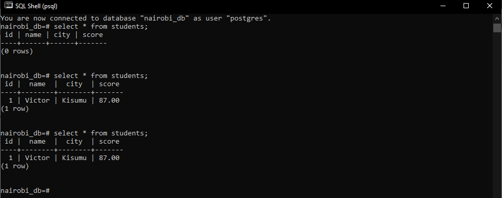
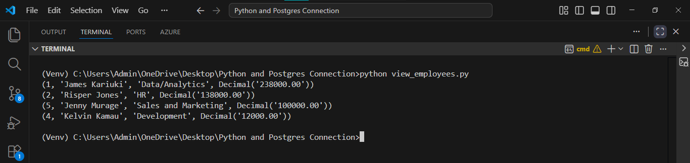

# Connecting to Postgres Db, creating a table and inserting data using Python

## Steps:

1.  Make a Directory with your preffered name
2.  Create a Virtual Environment and activate it.
    - On Windows

      ```python
      python -m venv Venv # Create the Virtual Environment

      Venv\Scripts\activateb # Activate the Environment
      ```
3.  Create 6 Files
    - .env
    - .env.example
    - db_config.py
    - add_student_data.py
    - create_employee_table.py    
    - add_employee_data.py
    - view_employees.py

    - .gitignore

4.  Using Pip Install psycopg2 Adapter and Python Dotenv
    ```python
    pip install psycopg2 python-dotenv
    ```
5.  Create a Database from SQL Shell(Postgres terminal).
    - Enter your local postgres credentials
      - localhost
      - database
      - port
      - username
      - password

    - Create a database with the name nairobi_db

      ```sql
       CREATE DATABASE nairobi_db;

       \l - List current databases to verify nairobi_db has been created
      ```

6.  Running scripts to create a table and inserting data
    - Run **db_config.py**
    - Run **add_student_data.py**
    - Run **create_employee_table.py**
    - Run **add_employee_data.py**
    - Run **view_employees.py**

7.  Generate a **requirements.txt** file.

    ```python
    pip freeze > requirements.txt
    ```

8.  Highlight unnecessary files/folders in the .gitignore file.

# FINAL OUTPUT:

- One Record has been Successfully inserted into the Students Table inside Nairobi_DB Database.

  

- 4 Records have been Successfully inserted into the Employees Table inside Nairobi_DB Database.
  

- View all employee records, order by salary(descending)  
  
